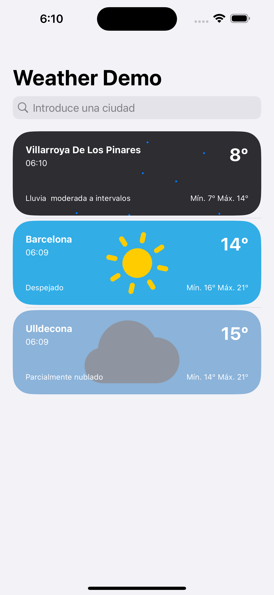

# 🌤️ WeatherDemo

**WeatherDemo** es una aplicación nativa para iOS desarrollada en SwiftUI que permite buscar ciudades y consultar el estado del tiempo actual.  
> 🧪 Este proyecto ha sido desarrollado como parte de una **prueba técnica** para un proceso de selección.

---

## 📱 Funcionalidades

- 🔍 Búsqueda de ciudades mediante geocodificación con **Nominatim (OpenStreetMap)**.
- 🌦 Consulta en tiempo real del clima actual (temperatura, condiciones).
- 💾 Persistencia local de las ciudades seleccionadas con **SwiftData**.
- 🗑 Posibilidad de eliminar ciudades guardadas.
- 🔄 Pull-to-refresh para actualizar el clima manualmente.
- ⚠️ Manejo de errores y alertas para fallos en la red o APIs.

---

## 🌐 Localización
La aplicación está completamente localizada en inglés y español.
Tanto la interfaz como los textos dinámicos se adaptan al idioma configurado en el sistema del usuario.

## 🔧 Tecnologías utilizadas

- ✅ Swift 6
- ✅ SwiftUI
- ✅ MVVM
- ✅ SwiftData (persistencia local)
- ✅ `async/await` para llamadas asincrónicas
- ✅ Macros de Swift para observación de estado
- ✅ API `wttr.in` para obtener datos del tiempo
- ✅ API `Nominatim` para geocodificar ciudades
- ✅ Transiciones y animaciones en SwiftUI
- ✅ **Tests unitarios con Swift Testing** para la capa de **repositorios** y **ViewModel**

---

## 🧪 Pruebas unitarias

El proyecto incluye pruebas unitarias utilizando **Swift Testing** centradas en:

- 🔁 Lógica del repositorio (guardado, borrado, recuperación de datos).
- 🧠 Comportamiento del ViewModel (búsqueda, selección y gestión de errores).

Esto garantiza la robustez de la lógica principal de la app de forma aislada.

---

## 🌍 ¿Por qué usar Nominatim?

Aunque `wttr.in` permite consultar el clima por nombre de ciudad, se utiliza **Nominatim** para convertir el nombre a coordenadas (latitud/longitud).  
Esto permite:

- Estandarizar todas las peticiones al usar coordenadas.
- Evitar errores por nombres mal escritos o ambigüedades.
- Mejorar la precisión de los resultados.

---

## 📸 Capturas de pantalla

<p align="center">
  
  
</p>

---

## ▶️ Instalación

1. Clona este repositorio:
	```bash
	git clone https://github.com/masterhardisk/Weather-Demo.git
	```
2. Abre el proyecto con Xcode 15 o superior.
3. Ejecuta en un simulador o dispositivo real.

## 🧪 Notas adicionales

- Este proyecto fue desarrollado como una prueba técnica y no está pensado para producción.
- La app persiste las ciudades guardadas localmente, pero los datos del clima se actualizan en cada apertura o al hacer pull-to-refresh.
- La app está localizada en **inglés** y **español**.

## 📄 Licencia

Uso exclusivo para fines de evaluación técnica.

###### Desarrollado por [Gerard Contador](https://gerardcontador.com)